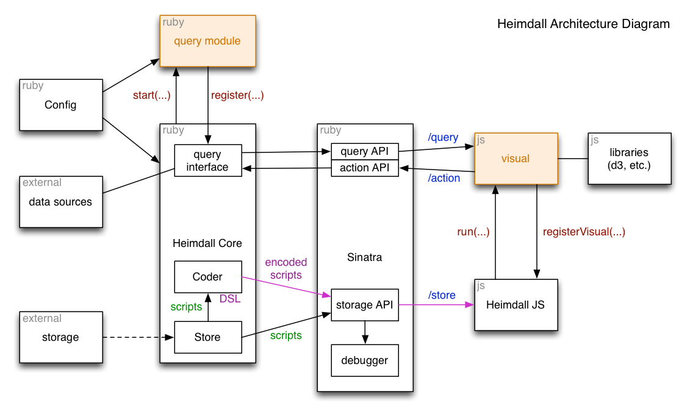

# Heimdall

Heimdall is a extensible/configurable visualization engine that combines a Ruby DSL
with Javascript visual widgets ("visuals") created for visualizing things like Chef
Server data.  _This documentation is a work-in-progress._

## Running Heimdall

Before running Heimdall, cd to the Heimdall top directory and run:

`bundle install`

[NB: Heimdall was built for Ruby 2.2.2; earlier versions of Ruby may or may not
work.]

Once that's done, you can start the server with:

`bin/server`

You can the connect to the debugger on localhost on port 9999 (by default). The root
path will automatically redirect to the `/debugger` endpoint if the debugger is
running.  Right now the debugger runs by default; in the future that behavior will
be reversed and the debugger will need to be turned on in a supplied config file.

An optional config file can also be supplied as an argument to the server script, as so:

`bin/server config.rb`

If you've changed the config.rb file use your Chef server, client, and key, you can
load the Chef server script and give it a whirl; to see that script, select the
`scripts` tab on the right in the debugger, click on `show system scripts` to show
the system scripts, and then load `chef-server` script (you can then click on the
red '`-`' button in the top right to hide the debug console).  Note that once you
start navigating through that script you're really exploring about fifteen different
scripts and Heimdall visuals that are all integrated together to work as one
coherent whole; to see just part of the system (and just a few scripts), you can
load any of the 'list' scripts to start there (though they won't show the source
JSON when loading the objects unless you include `{"show_json": "true"}` in the
arguments field &mdash; the Chef server script is the only one that has JSON configured
on by default), or even the individual object scripts, though those require a name
(or equivalent) to be supplied to show anything.

To run the tests, run:

`rspec`

## Key Terms ##

These describe the various components of the Heimdall system:

* `script`: ruby DSL code that gets executed by the Heimdall server to render a
  visual _block_ which corresponds with a Heimdall _visual_ of the same name written
  in Javascript (see below).  Can contain configuration code to affect the
  appearance and behavior of the visual.

* `query module`: a.k.a., module: this is a Ruby class that sets up queries and
  actions against something (like an external server) that is called from a
  Heimdall visual to retrieve the data it needs.

* `Heimdall visual`: a.k.a., visual: a Javascript function registered with the
  Heimdall Javascript library that renders itself in the supplied div.  Corresponds
  with a visual _block_ of the same name in the script DSL.

* `query`: a named function registered with the Heimdall server to return data.
  Supplied by a module, called from a visual.

* `action`: a named function registered with the Heimdall server to perform some
  function.  Supplied by a module, called from a visual.

## Scripting DSL ##

The scripting DSL looks something like this:

```
one = 'one'

visual 'debug' do
  set :any, "#{one}"
  set :version, Heimdall::VERSION
  set :calc do
    rc = 1
    1.upto(10) do |x|
      rc *= x
    end
    rc
  end
end
```

This script will initialize the 'debug' visual (which is also the default visual
that loads if the server doesn't recognize the supplied visual).  It sets the value
of `any` to the string 'one' and the value of `version` to whatever the current
version of Heimdall is, encodes everything into a JSON object and passes it to the
Javascript engine.  Blocks can also be supplied to the set calls, and will be
evaluated and assigned the same as any other values: `calc` will get a value of 10!
(that is, 3628800).  The names of the settings can be strings or symbols; everything
will get converted to strings once converted to JSON, other types will be ignored.

There should be only one visual block per script; if there are more than one, only
the values set in the last one will used.  Beyond that, any legal ruby can be used.

_The DSL is very much a work in progress; it's unlikely to look quite like this once
polished._

Parameters should be a JSON object passed to the script at runtime.

### A Note on Scripts

Scripts can be accessed via the `/store` REST API described below that the visual
engine uses (or indirectly through the debugger interface that accesses same).  An
important thing to note is that there are two kinds of scripts: user created and
system scripts.  System scripts cannot be modified (or deleted) by the user; most
system scripts are set up by Heimdall visuals to allow the visuals to integrate with
each other.  For instance, there are a number of included visuals for interacting
with Chef server objects, and these scripts are required to navigate between them
(e.g., the Chef cookbook list visual uses a system script to link to specific Chef
cookbooks via this mechanism).

## Config

The default way of configuring settings is `key value` although since key is really
a function, it can also be `key(value)`.  Module settings should be configured by
the name of the module, i.e., the Chef module keys like so: `chef.key value`.  The
`config` variable is available but not necessary (however, see the module_dirs in
the example below for one possible use).

Config files look something like this:

```
port 8001
debug_server true
module_dirs(config.module_dirs + ['/home/chef/heimdall/modules'])

chef_port_value = 3001

chef.url "http://localhost:#{chef_port_value}"
chef.client 'doubt72'
chef.key '<some path>'
```

Note that values can only be configured once before raising an error.

The following configuration settings are available at the top level:

* `port`: port Heimdall listens to.  Defaults to `9999`

* `debug_server`: whether to run the debug server.  Currently defaults to `true`

* `public_folder`: the root directory for CSS and Javascript files (both debugger
  and for Heimdall visuals &mdash; this includes some dynamically loaded ruby, see Visual
  section for how this works).  Note that there can only be one public directory
  used by Sinatra; if another directory is specified, any required lib/visual/system
  files will need to be copied there (which depending on what's being run could be
  some, all or none of the files).  Defaults to `'<repo_dir>/Heimdall/public'`

* `module_dirs`: a list of query module directories that will be loaded on
  launch. Default is `['<repo_dir>/lib/heimdall/query/modules']` &mdash; directories
  can be added to this and will be loaded on server launch.

Loaded modules will add configuration options.  For instance, the included Chef
module in the example above adds:

* `chef.server_url`: full url of the chef server, including the organization path.

* `chef.client_name`: name of the connecting client.

* `chef.client_key`: path to client's private key.

All of these default to `nil`.

## Server API

There are two endpoints available from the server, the simple storage REST API at
`/store` and the query API at `/query`.  Both of these are on the same port as the
debug server.

### Storage API

* `GET /store`: for listing all scripts

This will return a JSON list with all the names of stored scripts in string form.

* `POST /store`: for creating new scripts

This requires a JSON object with `name` and `script` keys (both strings).

* `GET /store/<name>`: for reading retrieved scripts

This will return a JSON object with `script` key.  If the `encode` parameter is
suppled with a value of `true`, it will encode the script for processing by
Javascript visuals.

* `PUT /store/<name>`: for updating scripts

This requires a JSON object with `script` keys (and the script in string form), which
is replaced for the given name.

* `DELETE /store/<name>`: for deleting scripts

### Query API

If any queries are registered on the server, they can be accessed from the query
endpoint:

* `POST /query`: make a query.

Two keys need to be supplied, `name` (name of the query key) and `query` (which is
passed to the query key function) on the server.  If an error occurs, an `error` key
is returned in the response body, or `return` if the query succeeds.

### Action API

If any actions are registered on the server, they can be accessed from the query
endpoint:

* `POST /action`: make an action request.

Two keys need to be supplied, `name` (name of the query key) and `action` (which is
passed to the action key function) on the server.  If an error occurs, an `error` key
is returned in the response body, or `return` if the query succeeds.

Mechanically, actions and queries work pretty much the same way, however the
semantics is different.  Queries should never have side affects or affect the
queried server in any way, actions may, and it's up to the creators of query modules
(which handle both) to follow this standard.  Both queries and actions should be in
the form of a string, and if any processing is required, it's up to the query module
to handle parsing it (for instance, if a complex &mdash; JSON, say &mdash; object is
required, it might be stringified before passing, and parsed by the query module).

## Query Modules

See the [query_modules.md](doc/query_modules.md) document file in the Heimdall doc
directory.

## Heimdall Visuals

See the [heimdall_visuals.md](doc/heimdall_visuals.md) document file in the Heimdall
doc directory.

## Server Architecture

It looks like this:



This is a slight simplification of the query/action interface due to space
constraints (they're actually distinct inside Heimdall core), but the internal
interface is the same.

## TODO List

* Properly modularize Sinatra (will require changes to test setup)
* Add logging
* Set up persistent data store to replace in-memory hash stub
* Sanitize/polish DSL (perhaps use cleanroom?)
* Switch to params in the debugger that aren't encoded in the URL (going to break down with long scripts)
* Add authn/authz filters/seperate perms for reading and writing storage endpoint
* Test in FF and Safari
* Switch debugger to default off unless configured
* query calls need to be configurable/explicit uri with port/server; deal with xss
* _**TEST VISUALS SOMEHOW**_
* Generally go through code TODOs
